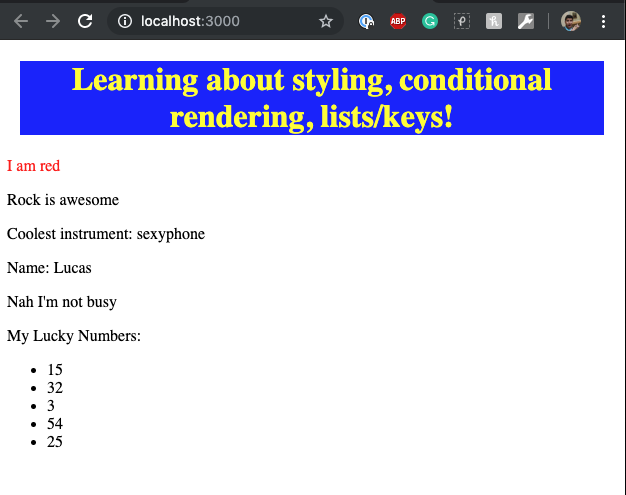

# Styling, Conditional Rendering and Lists

Demo:



## Styling

1. Import css file in main js file:

`import './index.css';`

2. Use standard css rules/syntax in this file. Example:

```css
// element
h1 {
  color: yellow
}

// class
.header-div {
  background-color: blue;
  margin: 10pt;
  text-align: center;
}

// id
#name-div {
  color: red;
}
```
```js
// App.js
const App = () => {
  const name = 'Lucas';
  const faveMusic = 'rock';
  const isBusy = false;
  return (
    <div>
      <div className="header-div">
        <h1> Learning about styling, conditional rendering, lists/keys! </h1>
      </div>
      <div id="name-div">
        I am red
      </div>
    </div>
  )
}
```

## Conditional rendering

[Read here](https://reactjs.org/docs/conditional-rendering.html)

1. Using if statements

- note that you can return JSX elements, or even entire components

```js
// App.js
const renderFaveMusic = (faveMusic) => {
  let musicParagraph;
  if (faveMusic === 'rock') {
    musicParagraph = <p>Rock is awesome</p>;
  } else if (faveMusic === 'house') {
    musicParagraph = <p>House is better </p>;
  } else {
    musicParagraph = <p>I guess country it is....</p>;
  }
  return musicParagraph;
}

const App = () => {
  const faveMusic = 'rock';
  return (
    <div>
      <div className="header-div">
        <h1> Learning about styling, conditional rendering, lists/keys! </h1>
      </div>
      <div id="name-div">
        I am red
      </div>
      <div>
        {renderFaveMusic(faveMusic)}
      </div>
    </div>
  )
}
```

2. Inline If with Logical && Operator

Use of `&&`

If the condition is true, the element right after && will appear in the output. If it is false, React will ignore and skip it.

```js
const coolInstruments = ['guitar', 'sexyphone', 'drums'];


const App = () => {
  const isBusy = false;
  // keep everything the same
  <div>
    <p>Coolest instrument: {coolInstruments.length > 2 && coolInstruments[1]} </p>
  </div>
}
```

3. Using ternaries

- If-Else with Conditional Operator

Another method for conditionally rendering elements inline is to use the JavaScript conditional operator `condition ? true : false`.

- you can do in-line ternaries

```js
const name = 'Lucas';

const App = () => {
  const isBusy = false;
  // keep everything the same
  <div>
    Name: { name ? name : 'not provided'}
  </div>
}
```

4. Not displaying a component

- just return null

```js
const isUserBusy = (isBusy) => {
  if (!isBusy) {
    return <p>Nah Im not busy</p>;
  } else {
    return null;
  }
}

const App = () => {
  const isBusy = false;
  // keep everything the same
  <div>
    {isUserBusy(isBusy)}
  </div>
}
```

## Lists and Keys

[Read about it here](https://reactjs.org/docs/lists-and-keys.html)

1. Rendering multiple components

- You can do so by using a map on an array:

```js
const showMyLuckyNumbers = () => {
  const luckyNumbers = [15, 32, 3, 54, 25];
  const listItems = luckyNumbers.map((number) =>
    <li>{number}</li>
  );
  return listItems;
}

// In App return
<div>
  {showMyLuckyNumbers()}
</div>
```

2. Better approach:

```js
const LuckyNumbers = () => {
  const luckyNumbers = [15, 32, 3, 54, 25];
  const listItems = luckyNumbers.map((number) =>
    <li>{number}</li>
  );
  return (
    <div>
      <p> My Lucky Numbers: </p>
      <ul>{listItems}</ul>
    </div>
  );
}

// In App return
<LuckyNumbers />
```

- Keys

Keys help React identify which items have changed, are added, or are removed. Keys should be given to the elements inside the array to give the elements a stable identity:

Example:

```js
const LuckyNumbers = () => {
  const luckyNumbers = [15, 32, 3, 54, 25];
  const listItems = luckyNumbers.map((number) =>
    <li key={number.toString()}>{number}</li>
  );
  return (
    <div>
      <p> My Lucky Numbers: </p>
      <ul>{listItems}</ul>
    </div>
  );
}

// In App return
<LuckyNumbers />
```

The best way to pick a key is to use a string that uniquely identifies a list item among its siblings. Most often you would use IDs from your data as keys:

```js
const todoItems = todos.map((todo) =>
  <li key={todo.id}>
    {todo.text}
  </li>
);
```

[Read more about it here](https://reactjs.org/docs/lists-and-keys.html#keys-must-only-be-unique-among-siblings)
